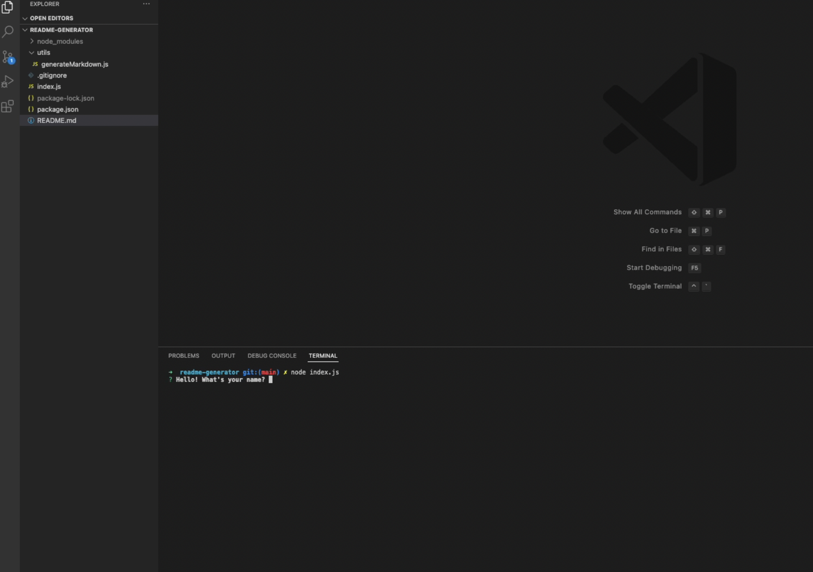

# Command Line ReadMe Generator
<p />By Michael Martens

[](https://opensource.org/licenses/MIT)

## Description
My main motivation was to complete the class project :) However, this was really fun. It helps to (at a minimum) provide the User with a starting point for a Readme. That's super useful because frankly, figuring out what to include can be a daunting task.

Check out an example video [here](https://drive.google.com/file/d/15rxNik6oWC8BTmMvqGdYN6OFxkk__Qmw/view?usp=sharing).


<br>

## Table of Contents
[Installation](#installation)<br />[Usage](#usage)<br />[License](#license)<br />[Contributing](#contributing)<br />[Tests](#tests)<br />[Questions](#questions)

## Installation
Clone the repo > run ```npm install``` to intialize the included dependencies > run ```node index.js``` to begin taking input.

## Usage
Its a great starting point. Run the intial prompts and then take over manually for further editing!

In terms of what you'll be asked.. we ask for the following input:

1. Name
2. Github username
3. Email address (*uses validation*)
4. Project title (*uses validation*)
5. Description
6. Licensing (*this can be expanded in the future*)
7. Installation
8. Usage (*you are currently here :)*)
9. Contributing
10. Tests

After some formatting to keep things looking pretty, we will return a Readme containing all info that was input as well as some direct links to your email, Github, and and licensing included.

## License
This project is licensed under the MIT license.

A short and simple permissive license with conditions only requiring preservation of copyright and license notices. Licensed works, modifications, and larger works may be distributed under different terms and without source code.<p />For more information visit https://choosealicense.com/licenses/mit/.

## Contributing
Other than what I learned in class, just myself! I grabbed most of my inspiration from the provided resources.

## Tests
No tests :)

## Questions
Find me on Github at https://github.com/makeithappenmike<p/>You can reach me at omichaelaaron@gmail.com if you have any questions.